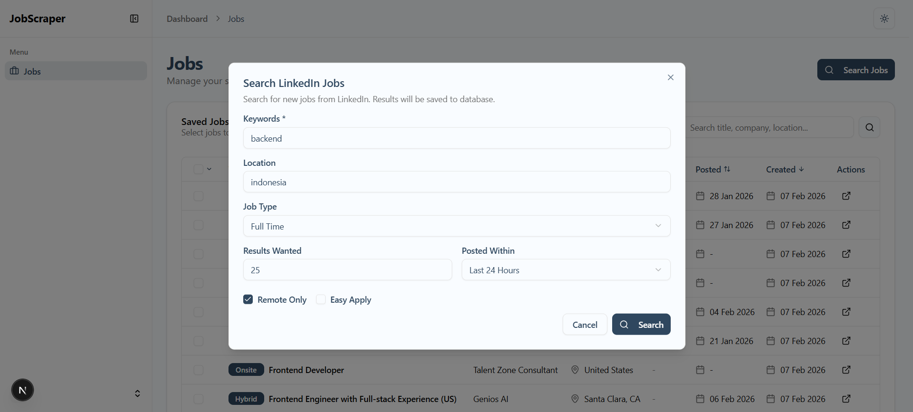

# LinkedIn Job Scraper

A full-stack application to scrape and manage job listings from LinkedIn.


## Features

- 🔍 **Search Jobs** - Scrape job listings from LinkedIn with filters
- 📊 **Dashboard** - View and manage saved jobs with sorting & pagination
- 🔄 **Real-time Progress** - WebSocket updates during scraping with rate limit countdown
- 💾 **Persistent Storage** - SQLite database for storing jobs
- 🐳 **Docker Ready** - Run with Docker Compose

## Screenshots




## Tech Stack

| Frontend     | Backend        |
| ------------ | -------------- |
| Next.js 15   | FastAPI        |
| React 19     | SQLAlchemy     |
| Tailwind CSS | BeautifulSoup4 |
| shadcn/ui    | WebSocket      |

---

## Quick Start

### Option 1: Docker (Recommended)

```bash
# Clone repository
git clone https://github.com/AlvinSugijanto/job_scraper.git
cd job_scraper

# Run with Docker Compose
docker-compose up --build

# Or run in background
docker-compose up -d --build
```

**Access:**

- Frontend: http://localhost:3000
- Backend API: http://localhost:8000
- API Docs: http://localhost:8000/docs

### Option 2: Manual Setup

#### Prerequisites

- Node.js 20+
- Python 3.11+

#### Setup

```bash
# Clone repository
git clone https://github.com/AlvinSugijanto/job_scraper.git
cd job_scraper

# Install root dependencies
npm install

# Setup server (venv + pip) and client (npm install)
npm run setup
```

#### Run Development

```bash
# Run both server & client
npm run dev
```

**Access:**

- Frontend: http://localhost:3001
- Backend API: http://localhost:8000

---

## Project Structure

```
job_scraper/
├── client/                 # Next.js frontend
│   ├── src/
│   │   ├── app/           # App router pages
│   │   ├── components/    # React components
│   │   └── lib/           # API utilities
│   └── Dockerfile
├── server/                 # FastAPI backend
│   ├── main.py            # API endpoints
│   ├── scraper.py         # LinkedIn scraper
│   ├── models.py          # SQLAlchemy models
│   ├── database.py        # DB connection
│   ├── websocket_manager.py
│   └── Dockerfile
├── docker-compose.yml
└── package.json           # Root scripts
```

---

## API Endpoints

| Method | Endpoint                 | Description                        |
| ------ | ------------------------ | ---------------------------------- |
| POST   | `/jobs/search`           | Search & scrape jobs from LinkedIn |
| GET    | `/jobs/stored`           | Get saved jobs with filters        |
| GET    | `/jobs/stored/{id}`      | Get job by ID                      |
| DELETE | `/jobs/stored/{id}`      | Delete job                         |
| DELETE | `/jobs/stored`           | Delete all jobs                    |
| WS     | `/ws/scrape/{client_id}` | WebSocket for scraping progress    |

### Query Parameters for `/jobs/stored`

| Param      | Type   | Description                                               |
| ---------- | ------ | --------------------------------------------------------- |
| search     | string | Search in title, company, location                        |
| sort_by    | string | title, company, location, salary, date_posted, created_at |
| sort_order | string | asc, desc                                                 |
| skip       | int    | Pagination offset                                         |
| limit      | int    | Results per page (max 100)                                |

---

## Environment Variables

### Client (.env.local)

```env
NEXT_PUBLIC_API_URL=http://localhost:8000
NEXT_PUBLIC_WS_URL=ws://localhost:8000
```

### Docker (docker-compose.yml)

Modify `args` in docker-compose.yml for production:

```yaml
args:
  - NEXT_PUBLIC_API_URL=http://your-server-ip:8000
  - NEXT_PUBLIC_WS_URL=ws://your-server-ip:8000
```

---

## Docker Commands

```bash
# Build and run
docker-compose up --build

# Run in background
docker-compose up -d

# Stop containers
docker-compose down

# View logs
docker-compose logs -f

# Rebuild specific service
docker-compose up --build server
docker-compose up --build client
```

---

## License

MIT
