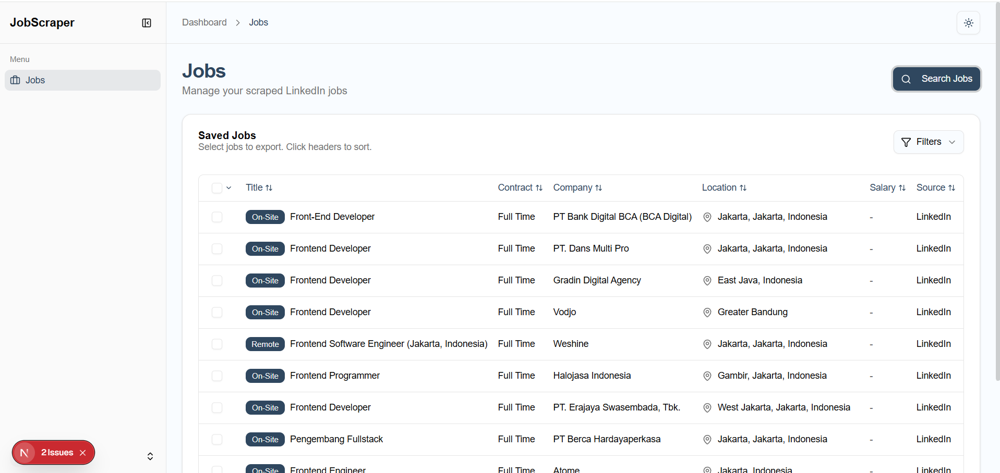
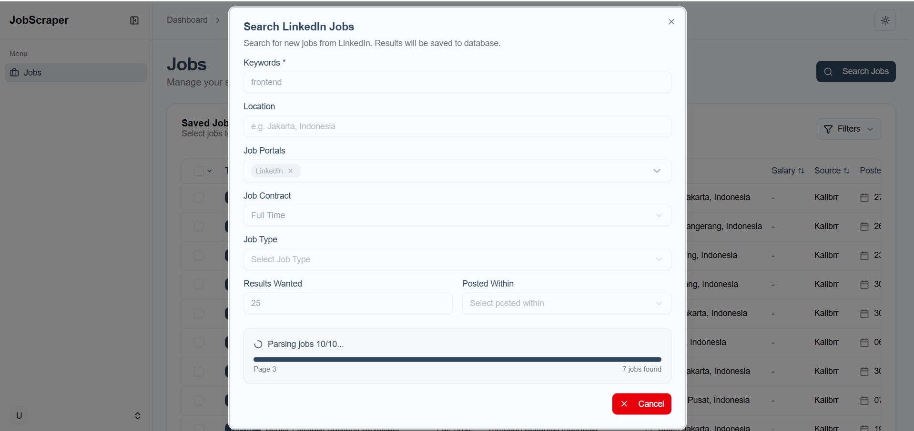
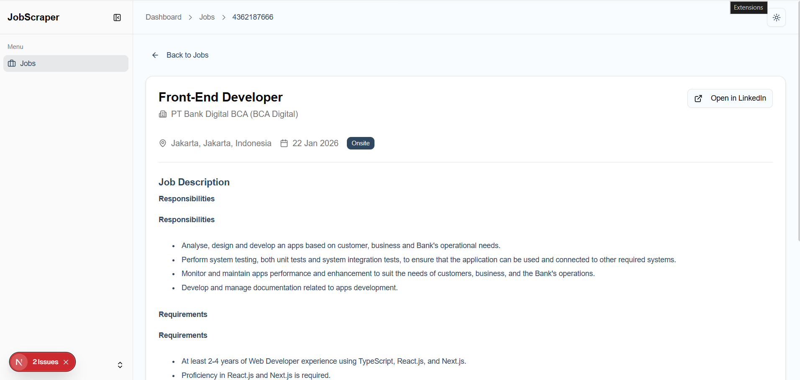

# Web Portal Job Scraper

A full-stack application to scrape and manage job listings from multiple web portal (LinkedIn, JobStreet, Glints).


## Features

- **Search Jobs** - Scrape job listings from LinkedIn with filters
- **Dashboard** - View and manage saved jobs with sorting & pagination
- **Filtering** - Skip jobs containing specific keywords (e.g., location restriction, tech stack mismatch) automatically using Banned Keywords & Companies configurations
- **Real-time Progress** - WebSocket updates during scraping with rate limit countdown
- **Persistent Storage** - SQLite database for storing jobs
- **Docker Ready** - Run with Docker Compose

## Screenshots







## Tech Stack

| Frontend     | Backend        |
| ------------ | -------------- |
| Next.js 15   | FastAPI        |
| React 19     | SQLAlchemy     |
| Tailwind CSS | BeautifulSoup4 |
| shadcn/ui    | WebSocket      |

---

## Quick Start

### Option 1: Docker (Recommended)

```bash
# Clone repository
git clone https://github.com/AlvinSugijanto/job_scraper.git
cd job_scraper

# Run with Docker Compose
docker-compose up --build

# Or run in background
docker-compose up -d --build
```

**Access:**

- Frontend: http://localhost:3000
- Backend API: http://localhost:8000
- API Docs: http://localhost:8000/docs

### Option 2: Development Setup

#### Prerequisites

- Node.js 20+
- Python 3.11+

#### Setup

```bash
# Clone repository
git clone https://github.com/AlvinSugijanto/job_scraper.git
cd job_scraper

# Install root dependencies
npm install

# Setup server (venv + pip) and client (npm install)
npm run setup
```

#### Run Development

```bash
# Run both server & client
npm run dev
```

**Access:**

- Frontend: http://localhost:3001
- Backend API: http://localhost:8000

#### Scaffolding Backend CRUD Layers (Migrations)

To easily scaffold new database models into complete CRUD layers (Schemas, Repositories, Services, Routers, and Tests) from the project root:

1. Create and define your SQLAlchemy model in `server/models/your_model.py`.
2. Register the model in `server/models/__init__.py`.
3. Run the generator script:

```bash
# Generate CRUD layers for a model
npm run migrations YourModelClassName

# Roll back generated CRUD layers
npm run migrations YourModelClassName rollback
```

---

## Project Structure

```
job_scraper/
├── client/                 # Next.js frontend
│   ├── src/
│   │   ├── app/           # App router pages
│   │   ├── components/    # React components
│   │   └── lib/           # API utilities
│   └── Dockerfile
├── server/                 # FastAPI backend
│   ├── main.py            # API endpoints
│   ├── scraper.py         # LinkedIn scraper
│   ├── models.py          # SQLAlchemy models
│   ├── database.py        # DB connection
│   ├── websocket_manager.py
│   └── Dockerfile
├── docker-compose.yml
└── package.json           # Root scripts
```

---

## API Endpoints

### Job Endpoints

| Method | Endpoint                 | Description                        |
| ------ | ------------------------ | ---------------------------------- |
| POST   | `/jobs/scrape`           | Trigger job scraping in background |
| GET    | `/jobs`                  | Get saved jobs with filters        |
| GET    | `/jobs/{id}`             | Get job by ID                      |
| WS     | `/ws/scrape/{client_id}` | WebSocket for scraping progress    |

### Session Endpoints

| Method | Endpoint         | Description                                  |
| ------ | ---------------- | -------------------------------------------- |
| GET    | `/sessions`      | Get all sessions (with search/pagination)    |
| POST   | `/sessions`      | Add a new session                            |
| PUT    | `/sessions/{id}` | Full update a session                        |
| PATCH  | `/sessions/{id}` | Partial update a session                     |
| DELETE | `/sessions/{id}` | Delete a session                             |

### Configuration Endpoints (Banned Keywords & Companies)

| Method | Endpoint                 | Description                                      |
| ------ | ------------------------ | ------------------------------------------------ |
| GET    | `/banned-keywords`       | Get all banned keywords (with search/pagination) |
| POST   | `/banned-keywords`       | Add a new banned keyword                         |
| PUT    | `/banned-keywords/{id}`  | Full update a banned keyword                     |
| PATCH  | `/banned-keywords/{id}`  | Partial update a banned keyword                  |
| DELETE | `/banned-keywords/{id}`  | Delete a banned keyword                          |
| GET    | `/banned-companies`      | Get all banned companies (with search/pagination)|
| POST   | `/banned-companies`      | Add a new banned company                         |
| PUT    | `/banned-companies/{id}` | Full update a banned company                     |
| PATCH  | `/banned-companies/{id}` | Partial update a banned company                  |
| DELETE | `/banned-companies/{id}` | Delete a banned company                          |

### Query Parameters for `/jobs`

| Param        | Type   | Description                                                                     |
| ------------ | ------ | ------------------------------------------------------------------------------- |
| search       | string | Search in title, company, location                                              |
| job_type     | string | Filter by job type (remote, hybrid, onsite)                                     |
| job_contract | string | Filter by job contract (full_time, part_time, internship, contract, temporary)  |
| location     | string | Filter by location                                                              |
| source       | string | Filter by source (linkedin, jobstreet, kalibrr)                                 |
| session_id   | int    | Filter by session ID                                                            |
| sort_by      | string | title, company, location, salary, date_posted, created_at (default: created_at) |
| sort_order   | string | asc, desc (default: desc)                                                       |
| page         | int    | Page number (default: 1)                                                        |
| perPage      | int    | Items per page (default: 25)                                                    |

---

## Environment Variables

### Client (.env.local)

```env
NEXT_PUBLIC_API_URL=http://localhost:8000
NEXT_PUBLIC_WS_URL=ws://localhost:8000
```

### Docker (docker-compose.yml)

Modify `args` in docker-compose.yml for production:

```yaml
args:
  - NEXT_PUBLIC_API_URL=http://your-server-ip:8000
  - NEXT_PUBLIC_WS_URL=ws://your-server-ip:8000
```

---

## Docker Commands

```bash
# Build and run
docker-compose up --build

# Run in background
docker-compose up -d

# Stop containers
docker-compose down

# View logs
docker-compose logs -f

# Rebuild specific service
docker-compose up --build server
docker-compose up --build client
```

---

## Banned Keywords & Companies Filtering

To improve scraper relevance and filter out low-quality listings (e.g., recruiter/staffing agency scams or irrelevant positions):

1. **Banned Companies**: During scraping, the system checks the company name of each job. If it matches a name in the banned companies list (case-insensitive), the job is skipped.
2. **Banned Keywords**: During scraping, the combined text (title, location, and description) is scanned for banned keywords. If any banned keyword is found, the job is skipped.

These rules can be configured on the frontend under the **Configuration** page or through the API.

---

## License

MIT
